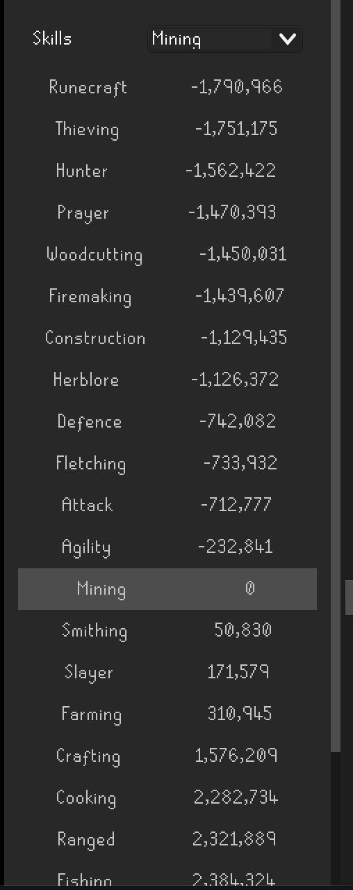

# Lowest Experience
Have ever being playing Runescape and thought...
* I need something to do
* I don't like training hunter, but I really don't like training Runecraft
* I wish I could figure out how many bird house runs I need before my tears will go into RC

Then you've come to the right place!

This plugin will show you which skill you have the lowest experience in, AND how much more you need to get before surpassing your next lowest skill. 
This can help you prioritized how to spend afk time, so your tears don't accidently go into firemaking...again

There is also a filtering feature so you can target which skill you want to see in relation to the others.
This helped me when I wanted to keep my defense and attack xp the same

